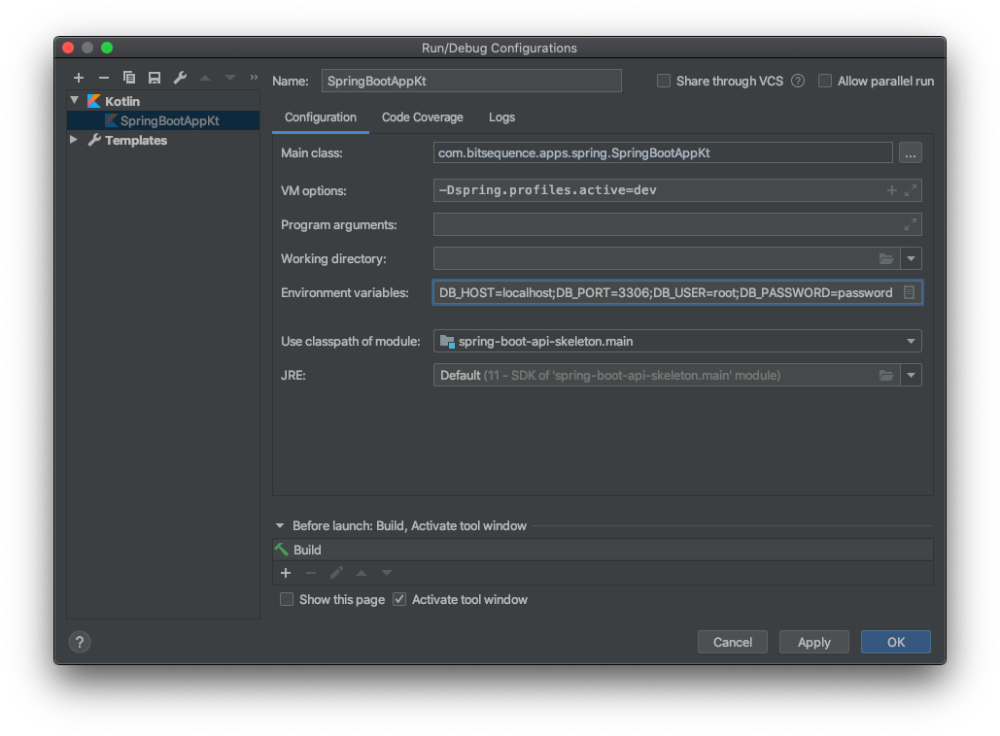
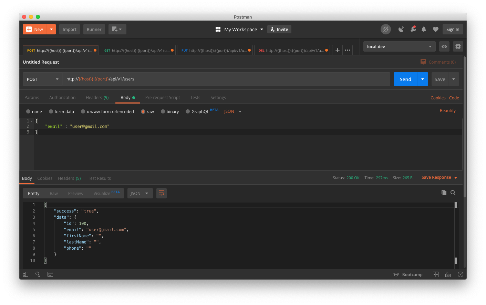
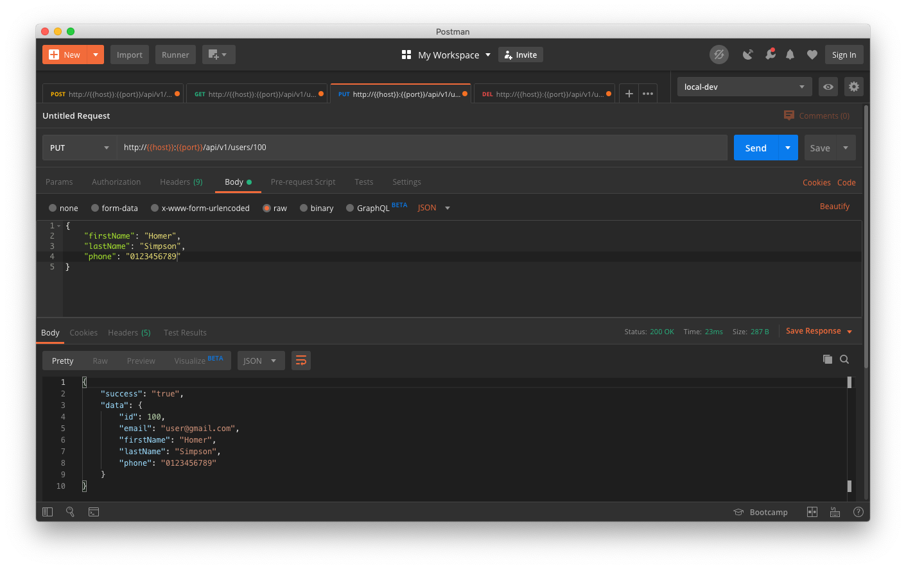
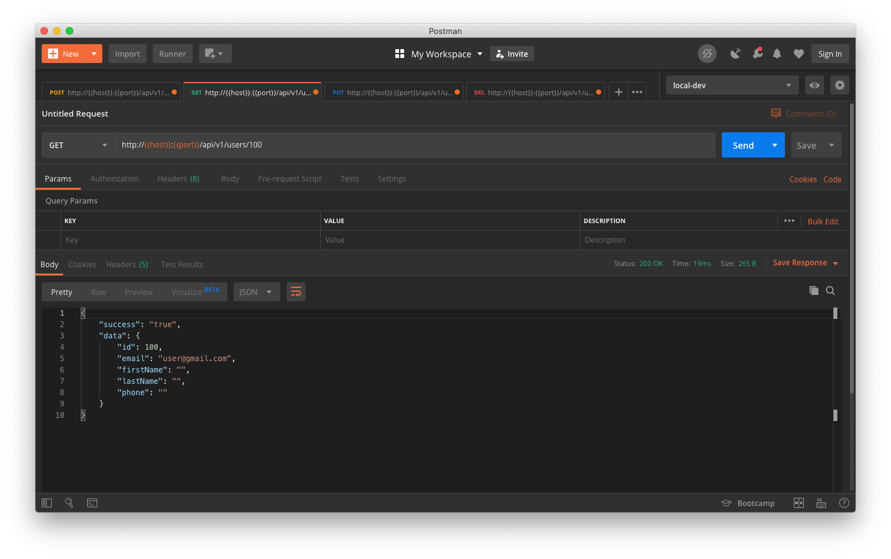
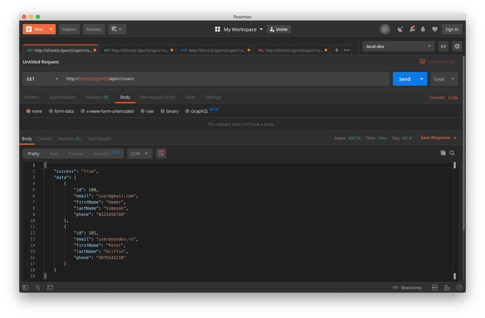
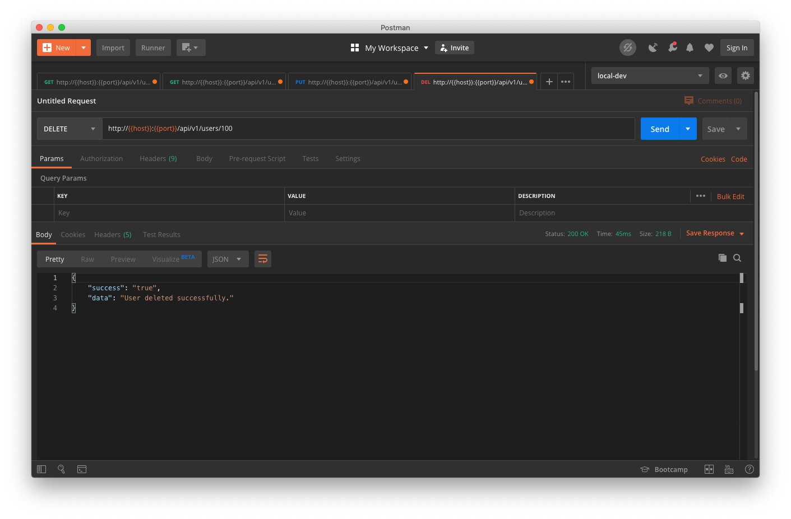

spring-boot-api-skeleton
========

Spring Boot Application written in Kotlin
----

#### JDK
 - [x] Java 11

#### Database
 - [x] MariaDB server running, can be changed easily in the `application.yml` for any other database

### Quick start

To start the app on linux/macOS from command line, you have to customize the environments or you set them in the `application.yml`  directly. 
For instance, in terminal:

    export DB_HOST=localhost DB_PORT=3306 DB_USER=root DB_PASSWORD=password
followed by:

    ./gradlew bootRunDev
to start the spring boot application.

Is also applicable in IntelliJ Idea



### Try it out

You can interact with [curl](https://curl.haxx.se/ "curl") or if you love gui, you can make the requests with a great tool [Postman](https://www.getpostman.com/ "Get postman").

##### Create a new user
```bash
curl -i -H "Accept: application/json" -H "Content-Type: application/json" -X POST http://localhost:9090/api/v1/users -d '{"email":"user@gmail.com"}'
```


##### Update user with the id 100
```bash
curl -i -H "Accept: application/json" -H "Content-Type: application/json" -X PUT http://localhost:9090/api/v1/users/101 -d '{"firstName":"Homer", "lastName":"Simpson"}'
```


##### Get user with the id 100
```bash
curl -i -H "Accept: application/json" -H "Content-Type: application/json" -X GET http://localhost:9090/api/v1/users/100
```


##### Get all users
```bash
curl -i -H "Accept: application/json" -H "Content-Type: application/json" -X GET http://localhost:9090/api/v1/users
```


##### Delete user with the id 100
```bash
curl -i -H "Accept: application/json" -H "Content-Type: application/json" -X DELETE http://localhost:9090/api/v1/users/101
```

